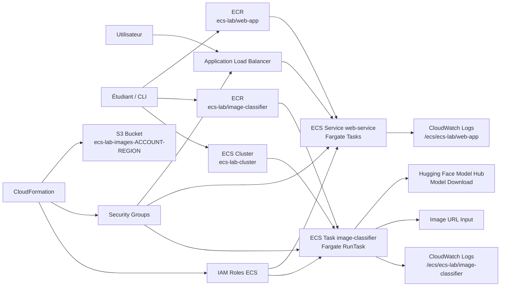
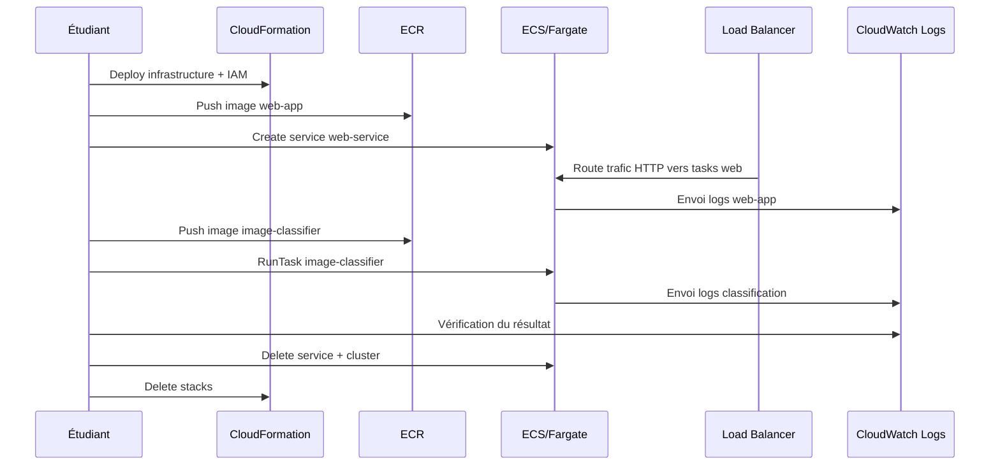

# Résultat Lab 8 - Amazon ECS Basics

## Résumé

Le lab 8 a été réalisé de bout en bout avec succès.

Le workflow validé

- déploiement de l'infrastructure de base avec CloudFormation
- création du cluster ECS `ecs-lab-cluster`
- build et push de l'image web dans ECR
- déploiement du service web ECS derrière un Application Load Balancer
- test applicatif réussi via l'URL ALB
- build local et validation du classificateur d'images
- push de l'image classificateur dans ECR
- exécution d'une tâche ECS Fargate de classification
- nettoyage final complet des ressources

## Résultat technique observé

Service web

- réponse HTTP valide depuis l'ALB
- payload JSON retourné par le conteneur
- informations ECS présentes dans la réponse (task ARN, cluster, launch type)

Classification d'image

- exécution locale validée sur plusieurs images
- prédictions cohérentes obtenues (`tiger`, `tabby cat`, `speedboat`)
- tâche ECS lancée et monitorée jusqu'à l'état `PROVISIONING` puis exécution

Nettoyage

- stack `ecs-lab-infrastructure` supprimée
- stack `ecs-lab-iam-roles` supprimée
- cluster ECS en état `INACTIVE`
- repositories ECR vidés avant suppression de la stack

## Schéma d'architecture

## Schéma de séquence

## Points d'attention

- Fargate nécessite une image `linux/amd64`
- `assignPublicIp=ENABLED` est nécessaire pour les tâches ayant besoin d'accès internet
- une stack CloudFormation avec ECR ne se supprime pas si les repositories contiennent encore des images

## Estimation de coût

Estimation pour une exécution complète du lab avec nettoyage final effectué:

- total estimé: entre `0,02 USD` et `0,08 USD`
- estimation centrale: environ `0,03 USD`

Répartition indicative:

- ECS Fargate (service web + tâche classifier): `0,005` à `0,03 USD`
- Application Load Balancer: `0,01` à `0,03 USD`
- IPv4 public (tâches avec `assignPublicIp=ENABLED`): environ `0,001 USD`
- CloudWatch Logs et stockage ECR: négligeable à cette durée

Niveau de certitude: moyen

L'estimation dépend du temps réel d'exécution des tâches, de la durée de vie de l'ALB et de la région AWS.

Références:

- [AWS Fargate Pricing](https://aws.amazon.com/fargate/pricing/)
- [Elastic Load Balancing Pricing](https://aws.amazon.com/elasticloadbalancing/pricing/)
- [Amazon VPC Pricing](https://aws.amazon.com/vpc/pricing/)
- [Amazon ECR Pricing](https://aws.amazon.com/ecr/pricing/)
- [Amazon CloudWatch Pricing](https://aws.amazon.com/cloudwatch/pricing/)
